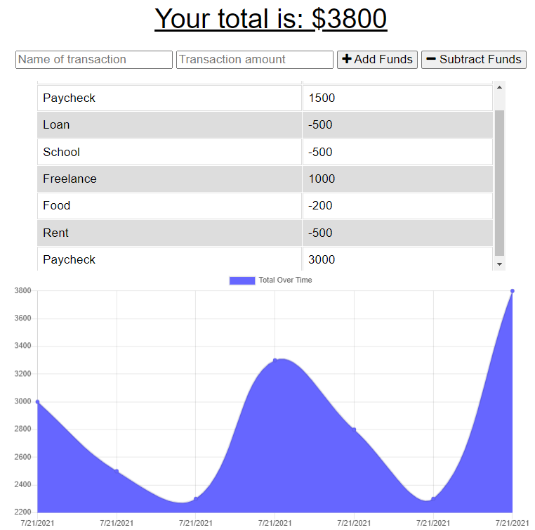

# Budget-App
 

## Description
This app allows a user to add expenses and deposits to their budget with or without a connection. When entering transactions offline, they should populate the total when brought back online.

## Table of Contents
- [Usage](#usage)
- [Deployed App](#deployed-app)
- [License](#license)
- [Contribute](#contribute)
- [Questions](#questions)

## Usage
Offline Functionality:

  * Enter deposits offline

  * Enter expenses offline

When brought back online:

  * Offline entries should be added to tracker.

## Deployed App
[https://fast-castle-21044.herokuapp.com/](https://fast-castle-21044.herokuapp.com/)

## License
© Licensed under the MIT License
## Contribute

In general, we follow the "fork-and-pull" Git workflow.

1. Fork the repo on GitHub
2. Clone the project to your own machine
3. Commit changes to your own branch
4. Push your work back up to your fork
5. Submit a Pull request so that we can review your changes
NOTE: Be sure to merge the latest from "upstream" before making a pull request
## Questions
Contact me:

- GitHub: [stamm2911](https://github.com/stamm2911)

- Email: edstamm29@gmail.com